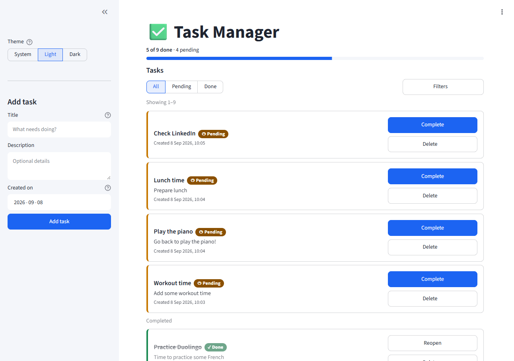
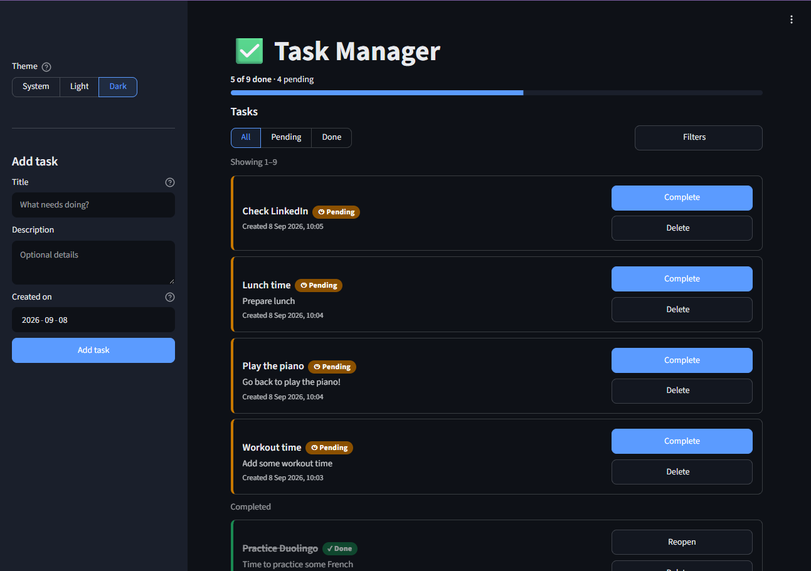

# Task Manager — FastAPI + SQLite + Streamlit

[](https://github.com/sbenitezma/fastapi-streamlit-todo/actions/workflows/ci.yml)

A complete to-do list application in two independent parts:

- **REST API** (FastAPI + standard `sqlite3`, no ORM) — port **8000**.
- **Dashboard** (Streamlit) that consumes the API over HTTP — port **8501**.

The dashboard **never** touches the database: it talks to the API through `requests`.

Everything runs inside **Docker**: you do not need to install Python or any
library on your machine. Once the containers are stopped, nothing is left installed.

## Screenshots

| Light | Dark |
|-------|------|
|  |  |

The **System / Light / Dark** switch is at the top of the sidebar; both palettes
are defined in `.streamlit/config.toml`.

## Layout

```
proyecto_2/
├── api/
│   ├── main.py           # FastAPI app + startup + domain-error handlers
│   ├── routes.py         # the 5 endpoints (delegate to the service via Depends)
│   ├── todos_service.py  # TodoRepository (all SQL) + TodoService (business rules)
│   ├── database.py       # SQLite engine: connection, pragmas, schema
│   └── models.py         # Pydantic models (validation)
├── frontend/
│   ├── streamlit_app.py   # entry point: wires the modules together
│   ├── component_library.py  # Storybook-style library -> `.\run.ps1 library`
│   ├── app/
│   │   ├── config.py      # constants and option maps
│   │   ├── api_client.py  # the only outward boundary (HTTP to the API)
│   │   ├── data.py        # st.cache_data layer + invalidate()
│   │   ├── formatting.py  # pure task -> string helpers      (unit tested)
│   │   ├── tasks.py       # pure list/dict transforms         (unit tested)
│   │   ├── filtering.py   # Filters value object + parsing    (unit tested)
│   │   ├── filters.py     # inline filter bar + chips
│   │   ├── styles.py      # design tokens + component CSS
│   │   ├── theme.py       # Light / Dark / System switch
│   │   ├── components/    # reusable UI components + its own README.md
│   │   ├── library/       # the component-library "stories"
│   │   └── views/         # sidebar, summary, task_list composition
│   └── tests/             # unit tests: api_client, formatting, tasks,
│                          #             filtering, components, library
├── .streamlit/
│   └── config.toml    # dashboard light & dark palettes, toolbar mode
├── tests/
│   ├── conftest.py    # temporary database isolated per test
│   └── test_todos.py  # >=1 test per endpoint
├── Dockerfile
├── docker-compose.yml
├── run.ps1 / run.bat  # task runner for Windows (see below)
├── Makefile           # same targets for macOS / Linux
├── pyproject.toml     # ruff + mypy config
├── requirements.txt / requirements-dev.txt
└── pytest.ini
```

## Only requirement

**Docker Desktop** installed and running (green icon, "Engine running").
Download: https://www.docker.com/products/docker-desktop/

You do not need Python or `pip` locally.

### First time on Windows Home: enable WSL 2

On Windows 11 Home, Docker Desktop needs the **WSL 2** backend. If opening Docker
Desktop shows *"Virtualization support not detected"*, it still has to be enabled:

1. Double-click **`setup-requirements.bat`** (it will ask for administrator rights).
2. **Reboot** the computer.
3. Open Docker Desktop and wait for "Engine running".

This is a one-time step. It requires hardware virtualization (VT-x) to be enabled
in the BIOS/UEFI, which it usually already is.

## Quick start

From PowerShell, in the project folder:

```powershell
.\run.ps1 start
```

Or just **double-click `run.bat`**. On macOS / Linux use `make start` instead
(same targets — see below).

Then open in your browser:

| What | URL |
|------|-----|
| Dashboard (Streamlit) | http://localhost:8501 |
| API (FastAPI)         | http://localhost:8000 |
| API docs              | http://localhost:8000/docs |

## Script commands

| Command | What it does |
|---------|--------------|
| `.\run.ps1 start`   | Build if needed and start API + dashboard in the background |
| `.\run.ps1 stop`    | Stop the containers (data is kept) |
| `.\run.ps1 restart` | `stop` + `start` |
| `.\run.ps1 rebuild` | Rebuild the image from scratch |
| `.\run.ps1 logs`    | Live logs (Ctrl+C to exit) |
| `.\run.ps1 status`  | Container status |
| `.\run.ps1 test`         | Run `pytest` inside a container |
| `.\run.ps1 lint`         | Run `ruff` + `mypy` inside a container |
| `.\run.ps1 library`      | Start the component library container → http://localhost:8502 |
| `.\run.ps1 library-stop` | Stop the component library container |
| `.\run.ps1 shell`        | Open a shell inside the API container |
| `.\run.ps1 clean`   | Stop everything and **also delete the data volume** (asks for confirmation) |
| `.\run.ps1 help`    | Help |

`run.bat` accepts the same: `run.bat stop`, `run.bat logs`, etc. With no argument it starts.

On **macOS / Linux**, the `Makefile` exposes the same targets — `make start`,
`make test`, `make logs`, `make clean`, … and `make` on its own prints the list.

## Data

The SQLite database lives in the Docker volume `todo-data` (mounted at
`/app/data/todos.db` inside the container). It survives `stop`, `restart` and
`rebuild`. Only `clean` removes it.

The container runs as an unprivileged user (`appuser`, uid 1000). If you kept a
`todo-data` volume from an older build that ran as root, recreate it once with
`make clean` / `.\run.ps1 clean`.

## Tests

```powershell
.\run.ps1 test     # Windows
make test          # macOS / Linux
```

Runs `pytest` over both suites inside a container:

- **`tests/`** — the API. Each test uses its own temporary SQLite database.
- **`frontend/tests/`** — the dashboard's pure modules (`api_client` with the
  HTTP layer mocked, `formatting`, `tasks`, `filtering`, `components`). No server
  needed.

## Code quality

```powershell
.\run.ps1 lint     # Windows
make lint           # macOS / Linux
```

Runs **ruff** (lint + format check) over the repo and **mypy** over `api/`.
Config is in `pyproject.toml`. CI runs the same checks on every push and PR.

## Endpoints

| Method | Path                  | Description                                         |
|--------|-----------------------|----------------------------------------------------|
| GET    | `/api/todos`          | List tasks. Supports `status` and a date range (see below) |
| GET    | `/api/todos/{id}`     | Details of a single task (404 if not found)         |
| POST   | `/api/todos`          | Create a task. `title` required; `description` and `created_at` optional |
| PATCH  | `/api/todos/{id}`     | Update `title`, `description` and/or `status`       |
| DELETE | `/api/todos/{id}`     | Delete a task (404 if not found)                    |

### `POST /api/todos` body

| Field        | Required | Notes |
|--------------|----------|-------|
| `title`      | yes | 1–200 chars, not blank. |
| `description`| no  | up to 2000 chars. |
| `created_at` | no  | `YYYY-MM-DD` to record a past task. Defaults to now; a future date returns `422`. |

### `GET /api/todos` query parameters

| Parameter    | Values | Description |
|--------------|--------|-------------|
| `status`     | `pending` \| `done` | Filter by status. |
| `date_field` | `created` \| `updated` \| `completed` (default `created`) | Which timestamp the date range applies to. |
| `date_from`  | `YYYY-MM-DD` | Inclusive lower bound on `date_field`. |
| `date_to`    | `YYYY-MM-DD` | Inclusive upper bound on `date_field`. |
| `limit`      | `1`–`1000` | Page size. Defaults to `100`; the list is always capped. |
| `offset`     | `>= 0` | Rows to skip, for paging. |

Example: `GET /api/todos?status=done&date_field=completed&date_from=2026-09-01`.
Malformed dates and an out-of-range `limit` return `422`.

### Task model

```json
{
  "id": 1,
  "title": "Buy bread",
  "description": "From the corner bakery",
  "status": "pending",
  "created_at": "2026-09-07T10:00:00+00:00",
  "updated_at": "2026-09-07T10:00:00+00:00",
  "completed_at": null
}
```

`status` can only be `pending` or `done`. `completed_at` is set automatically when
a task first becomes `done` and cleared when it is reopened — it is never sent by
the client. Empty or blank titles are rejected with `422`; a `PATCH` with no
fields returns `400`.

## Filtering the list

The filter controls sit **above the list**, next to the count they change:

- an inline **status** control (All / Pending / Done);
- a **Filters** popover for the date range (which timestamp, From, To);
- **removable chips** for every active filter, plus **Clear all**.

The selection is mirrored to the URL (`?status=…&date_from=…`), so a filtered
view is shareable and survives a reload.

## Theme

A **System / Light / Dark** switch sits at the top of the sidebar. It drives
Streamlit's native theming (so every widget is themed consistently) and mirrors
the choice to the URL (`?theme=`) so it survives reloads. The built-in switcher
in the toolbar menu stays available too. Both palettes are defined in
`.streamlit/config.toml`.

## Component library

The dashboard's UI is built from a small internal library of reusable Streamlit
render functions in **`frontend/app/components/`** (not a separate package):

| Component | Purpose |
|-----------|---------|
| `badge` / `badge_html` | status pill; `data-tone` drives the colour |
| `chip` / `chip_row`    | removable filter tags, wrapping |
| `meter`                | progress bar + caption (handles `total=0`, over-target) |
| `card`                 | bordered container with a coloured left edge + muted state |
| `load`                 | run a fetch behind a spinner; on error show a message + Retry |
| `empty_state`          | friendly zero-data panel with an optional call to action |
| `segmented_filter`     | label→value single-select |
| `pager`                | Previous / Next controls |
| `confirm_button`       | two-step destructive action (popover + confirm) |

Conventions, the props table and the loading/empty/error matrix are documented in
**`frontend/app/components/README.md`**.

### Browsing it — the Component Library

A **Storybook-style** browser (`frontend/component_library.py`): a sidebar list of
components; click one for its isolated page with a live **canvas**, **controls**,
every **state** (long text, empty, error, disabled, wrapping) and copy-paste
**usage**. It carries the **same Light / Dark / System switch** as the app.

It runs as its own opt-in Docker service (`library` profile, port **8502**):

```powershell
.\run.ps1 library        # start  -> http://localhost:8502
.\run.ps1 library-stop   # stop
```

A plain `.\run.ps1 start` does **not** launch it; `stop` / `clean` do tear it down.

## Accessibility

The dashboard styles target WCAG 2.1 AA:

- Task status is encoded **three ways** — a text label ("Pending" / "Done"), an
  icon, and a coloured card edge — never colour alone.
- All colour pairs (badges, muted text) meet the 4.5:1 contrast ratio and were
  verified in both light and dark themes (measured 6.5–9.7:1).
- A strong, always-visible **keyboard focus ring** on every control.
- Click/tap targets are at least ~40 px tall.
- `prefers-reduced-motion` disables transitions and animations.
- Destructive actions (delete) ask for confirmation first.
- Task text is HTML-escaped before rendering.
- Headings follow a sane order (`h1` → `h2`); the page declares `lang="en"`.
- The "Created on" picker blocks future dates; the API rejects them as well.

Known limitation: Streamlit does not emit a `<main>` landmark, which is outside
the app's control.

## Running without Docker (optional)

If you ever want to run it without containers you will need Python and the
dependencies. To keep your machine clean, use a virtual environment:

```powershell
python -m venv .venv
.venv\Scripts\Activate.ps1
pip install -r requirements.txt
python -m api.main                          # API on :8000
streamlit run frontend/streamlit_app.py     # dashboard on :8501 (separate terminal)
streamlit run frontend/component_library.py  # component library on :8502 (optional)
```

Deleting the `.venv` folder leaves the machine clean again.

## Environment configuration

- `TODOS_DB` — path of the API's SQLite file (Docker sets it to `/app/data/todos.db`).
- `API_URL` — base URL of the API used by the dashboard (Docker sets it to `http://api:8000/api`).

## License

MIT — see [LICENSE](LICENSE).
